# Web3 Carnival — Website Redesign

**Kalakriti 2026 · Theme 3: FinTech · Scenario 1**

**Live site:** https://web3carnival-redesign-e6df.vercel.app/
**Company overview deck:** [live](https://web3carnival-redesign-e6df.vercel.app/deck) · [PDF](company-overview-deck.pdf)

---

## The problem

Web3 Carnival is a real global blockchain event platform. Their site is not
ugly — it is badly structured. Three years of events have been bolted onto a
2023 landing page that was never reorganised.

The page title still reads "Web3 Carnival 2023."

What we found on the live site:

| Problem | Detail |
|---|---|
| Stale framing | Presents itself as a single 2023 event, not an ongoing platform |
| Flat speaker list | 69 speakers — from AWS, Mastercard, Coinbase, Accenture, Ford — in one undifferentiated grid |
| Unsorted history | 14 events across Bengaluru, Dubai, Singapore and Delhi shown as one continuous wall |
| Uncategorised partners | 100+ sponsor, VC, media and community logos with no tiering |
| Buried proof | 5000+ attendees, 250+ investors — the sponsor pitch — sits below the logo wall |
| Raw form links | "Get Involved" is six bare Tally links at the bottom of the page |
| Broken header | White bar against a dark page, logo in its own box, two competing CTAs plus a second nav row |
| Dead links | All seven conference tracks link back to the homepage |

---

## Our thesis

**The site is an archive pretending to be an event page. We turned the archive
into the proof.**

Web3 Carnival's history is its strongest asset and its worst-presented one.
Fourteen editions across four countries, sixty-nine speakers from companies
people recognise — all flattened into walls of undifferentiated content.

We did not add content. We gave the existing content a spine. Past editions
stop being clutter and become the credibility engine that sells the next event.

---

## Who the site is for

Four audiences arrive wanting different things. The current site serves all
four with the same scroll. Ours splits and routes each path.

| Audience | Question | Route |
|---|---|---|
| Attendee | "Is this worth my ticket?" | Tracks → speakers → register |
| Sponsor | "Is this audience worth my money?" | Stats → who attends → past sponsors → sponsor CTA |
| Speaker | "Is this stage worth my reputation?" | Featured speakers → tracks → apply |
| Ecosystem partner | "What's in it for us?" | Tiered partners → get involved |

Full user flow diagrams: [`docs/user-flows.md`](docs/user-flows.md)

---

## What we changed

**Structure**
- Stats moved from mid-page to position 2 — the sponsor is the highest-value
  visitor and the numbers are the pitch
- Speakers staged: 8 featured, then a filterable archive of all 69
- Past editions filterable by city, reframed as proof of scale
- Partners split into real tiers: sponsors, VCs, community, media, ticketing,
  payments
- Six bare Tally links became six labelled application paths with context
- Every track now links somewhere
- 12 routes covering the full user journey, not a single scrolling page

**Interface**
- One continuous dark field. No alternating coloured sections, no hard seams.
  Colour comes from overlapping soft radial glows, not panels of paint.
- The event posters and speaker photographs are the only colour on the site.
  The interface is deliberately quiet so the events carry the visual weight.
- Monospace for metadata only — dates, indices, locations, filters. Display
  type for headlines, sans for prose.
- Spatial hero: event posters as panels at varying depth with real CSS
  perspective, pointer parallax, and click-to-focus so any poster can be
  brought forward and read full size.

**Honesty**
Nothing on this site states a fact we could not source from the live
web3carnival.world. No invented dates, no fake countdowns, no fabricated
ticket tiers. Every application link points at the real Tally form.

---

## Design decisions

**Why dark** — their existing site is dark and the brief requires brand
fidelity. We kept it, but replaced the navy-on-navy (where cards, sections and
background were all near-identical blues) with a single continuous near-black
field lit by soft radial glows.

**Why the interface has almost no colour** — Web3 Carnival's event posters are
visually loud: hot pink, neon teal, warm orange. If the interface competes
with them, both lose.

**Why monospace on metadata** — the concept is an archive. Monospace numerals,
dates and labels signal catalogued information. Restricting it to metadata
keeps the reference without the page reading as a terminal.

**Why the stats moved up** — the sponsor has the most to spend and the least
patience. 5000+ attendees and 250+ investors is the entire pitch, and it
currently sits below a hundred logos.

**Why nothing renders in full** — 69 speakers, 70 partner logos and 14
editions cannot all be on one screen. Everything stages: featured set, then
filters, then full archive on request.

---

## Screens

### Desktop

#### Homepage


#### Speakers — full archive with filtering

#### Past editions
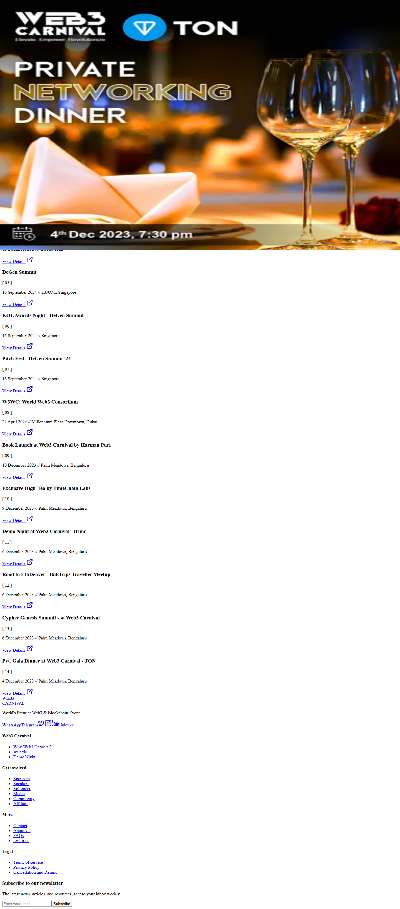

#### Sponsors and partners
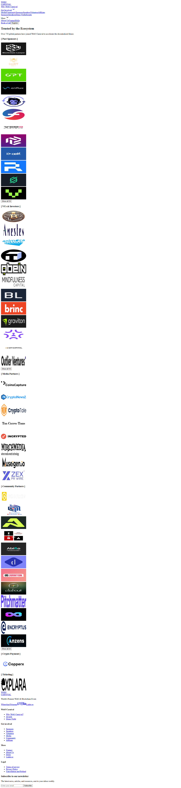

#### Get involved
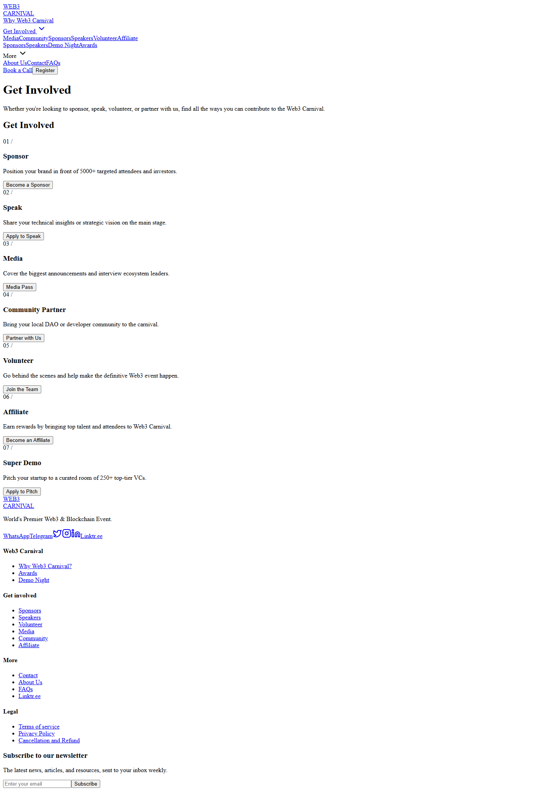

#### Demo Night
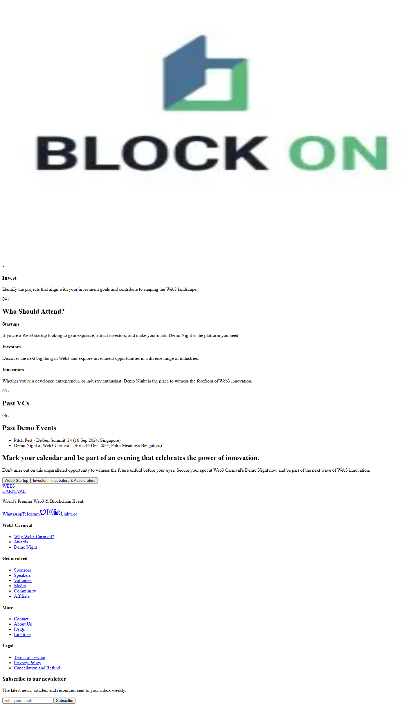

#### Awards
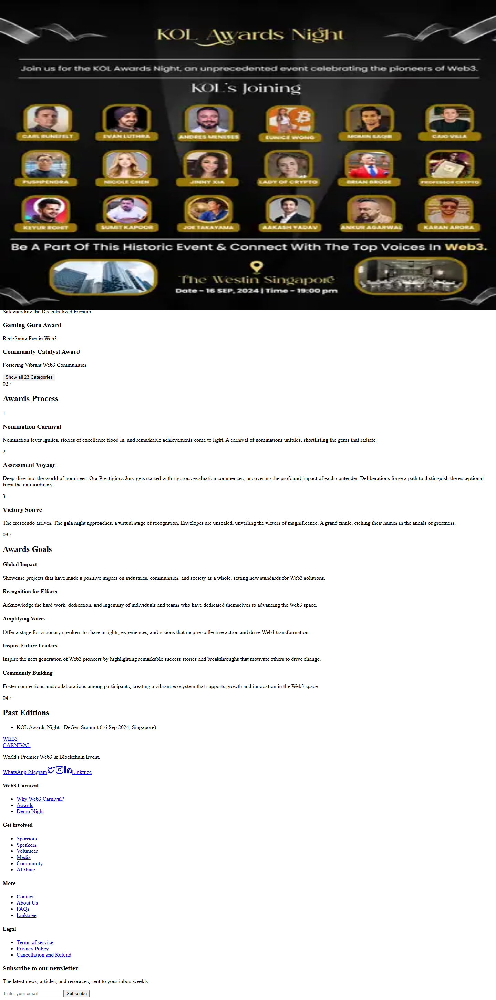

#### Registration flow
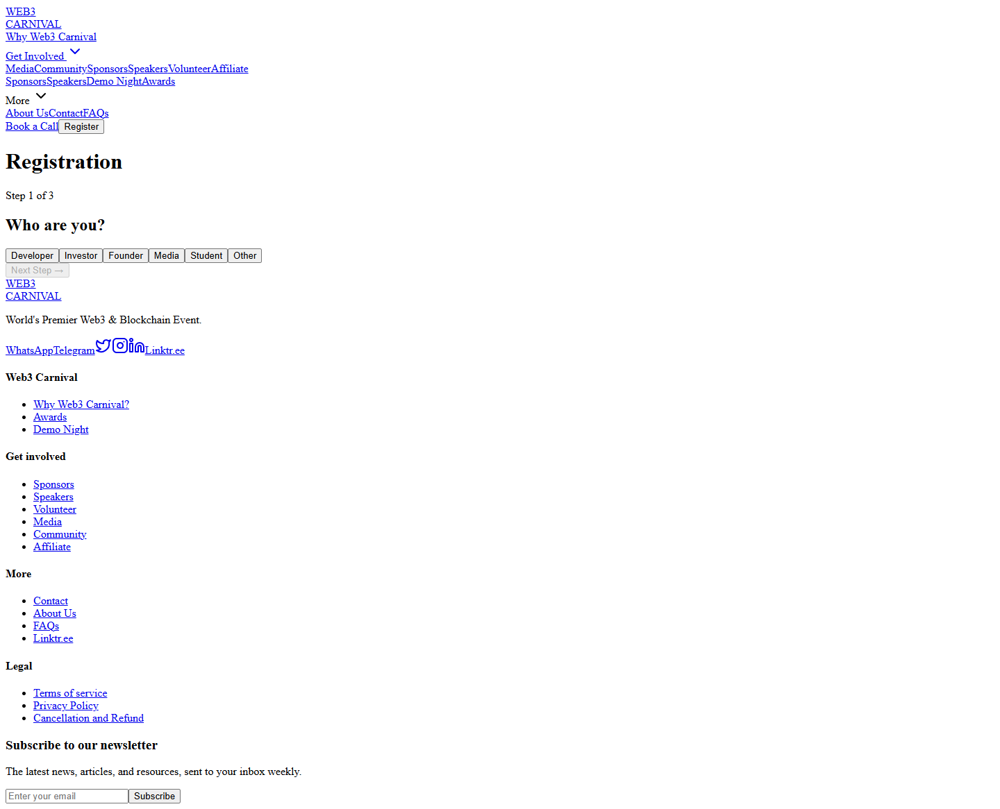

#### Why Web3 Carnival
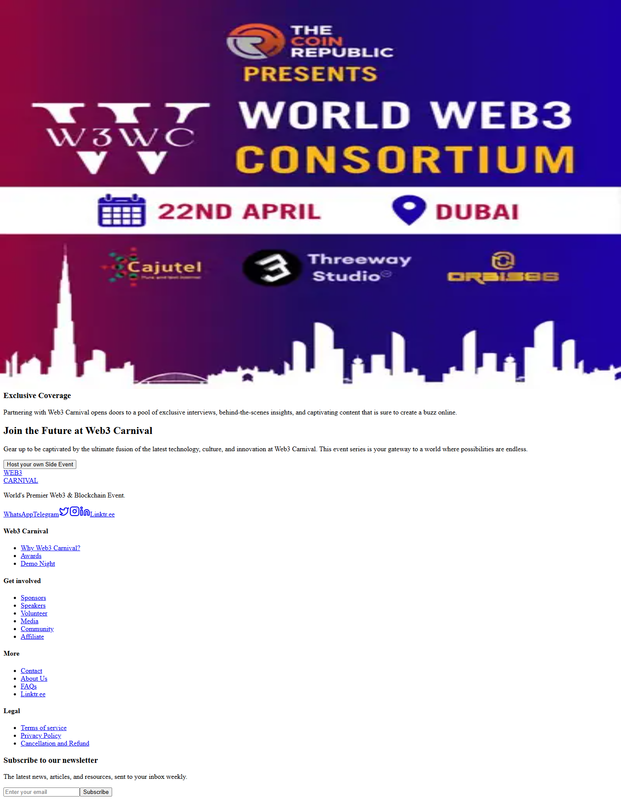

### Mobile

| Homepage | Speakers | Editions |
|---|---|---|
|  |  | 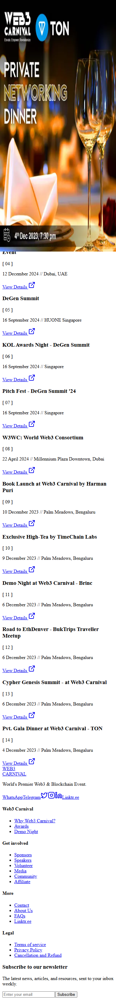 |

---

## Accessibility

Lighthouse: Accessibility 91 · Best Practices 100 · SEO 100

- All text meets 4.5:1 contrast minimum
- Semantic heading hierarchy throughout
- Keyboard navigable with visible focus states
- `prefers-reduced-motion` disables all parallax, tilt and drift
- Touch targets 44px minimum
- Descriptive alt text on every image

---

## Built with

Next.js (App Router) · TypeScript · Tailwind CSS · Framer Motion · Vercel

All content, imagery and brand assets are the property of Web3 Carnival and
Threeway Studio. They appear here only within a non-commercial design
competition entry.

---

## Team

YOUR_NAMES_HERE
