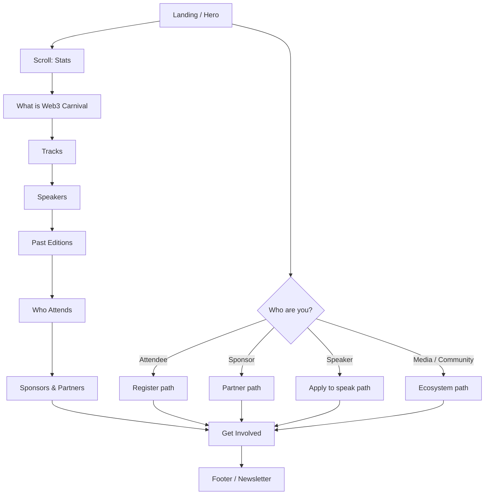
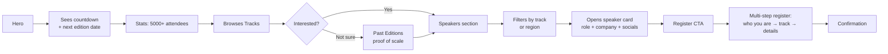
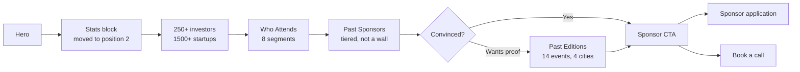
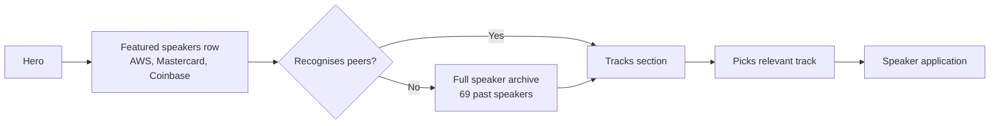
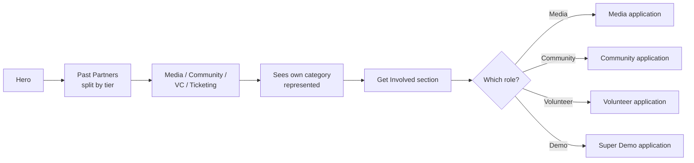
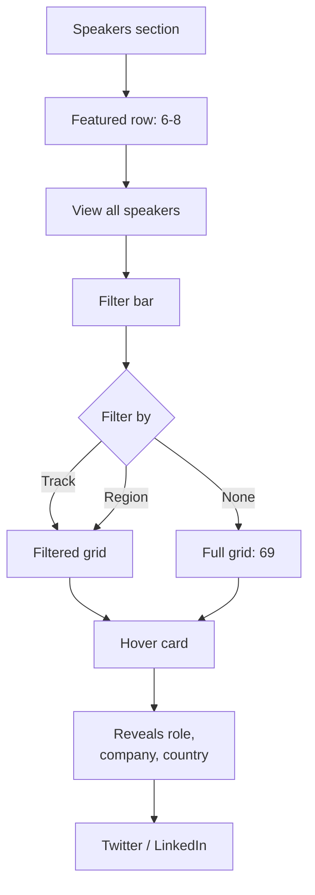

# Web3 Carnival — User Flows

Four audiences land on this site wanting different things. The current site
serves all four with one undifferentiated scroll. These flows show how the
redesign splits and routes each path.

---

## 1. Primary navigation map

---

## 2. Attendee flow — "is this worth my ticket?"

**Key decision:** register is a 3-step form, not a raw external link.
Asking "who are you / which track" first lets the event segment its
audience and gives the attendee a sense the event is tailored.

---

## 3. Sponsor flow — "is this audience worth my money?"

**Key decision:** stats move from buried mid-page to position 2. The sponsor
is the highest-value visitor and the numbers are the pitch. Currently they
sit below a wall of logos.

---

## 4. Speaker flow — "is this stage worth my reputation?"

**Key decision:** featured row surfaces 6-8 recognisable employers before
the full grid. A prospective speaker judges the stage by who stood on it
already — that signal is currently lost in a flat list of 70.

---

## 5. Ecosystem partner flow — media, community, VC

**Key decision:** the 6 applications currently sit as raw Tally links at the
bottom of the page. Turned into labelled cards with one line each, so a
visitor knows which one applies to them before clicking.

---

## 6. Speaker discovery — the core interaction

**The clutter fix:** 69 speakers never render at once by default. Featured
row first, filters second, full grid on request. Same content, staged.

---

## 7. Information architecture — before vs after

```mermaid
flowchart TB
    subgraph BEFORE["CURRENT SITE"]
        B1[Hero] --> B2[14 past events<br/>flat wall]
        B2 --> B3[3 long text blocks]
        B3 --> B4[Stats<br/>buried]
        B4 --> B5[70 speakers<br/>flat grid]
        B5 --> B6[8 segments]
        B6 --> B7[100+ logos<br/>uncategorised]
        B7 --> B8[6 raw form links]
    end

    subgraph AFTER["REDESIGN"]
        A1[Hero + countdown] --> A2[Stats<br/>promoted]
        A2 --> A3[Short intro<br/>3 sentences]
        A3 --> A4[7 tracks<br/>interactive]
        A4 --> A5[Featured speakers<br/>+ filterable archive]
        A5 --> A6[Past editions<br/>by city]
        A6 --> A7[Who attends]
        A7 --> A8[Partners<br/>tiered + collapsed]
        A8 --> A9[Get involved<br/>6 labelled cards]
    end
```

---

## Anti-clutter rules applied throughout

The brief's biggest risk on this scenario is volume. Three rules:

1. **Nothing renders in full by default.** 69 speakers → featured 8.
   100+ logos → top tier visible, rest behind "show all". 14 events →
   filtered by city.

2. **Three sentences maximum per text block.** The current site has four
   dense paragraphs describing what the event is. Nobody reads that.

3. **One accent colour, on interactive elements and numbers only.** If
   purple is on every section background it stops meaning "click me".
